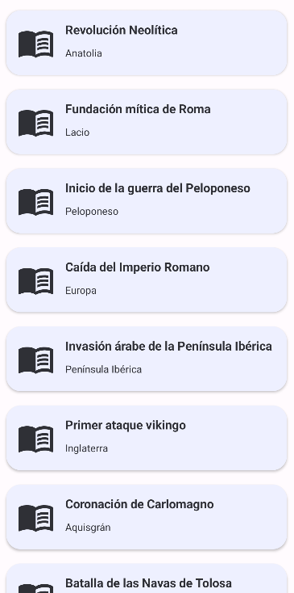
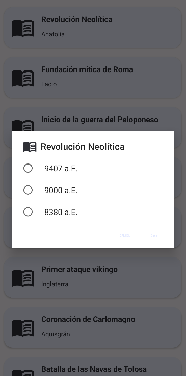

<image src="./docs/images/logo.png" height="150" />

<h1 align="center">History Events Game</h1>

History Events Game is a basic **Android** app made with *Java*, which consists of a gema using CardView, that asks you the dates of different historic eventsIt uses dynamic theming.

## Features

- Access to an XML document which contains the historic events
- Showing cards with Cardview
- React to dynamic themes

## Gallery

    
    

